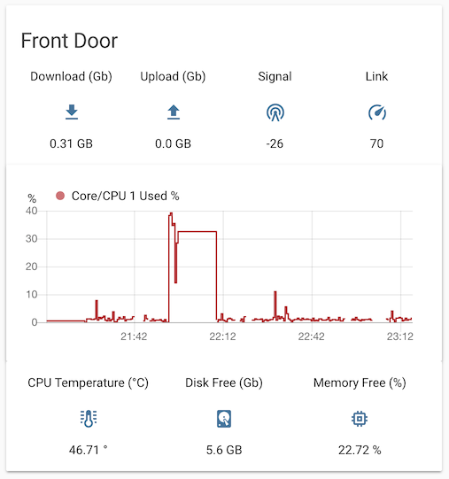

# Home Assistant - Monitoring API

Welcome to the lightweight "ha-monitor-api" project! 

This is a quick-and-dirty lightweight API _(knocked out in an evening)_ designed to expose the system's current metrics _(such as disk, network, cpu/temperature etc)_ as a simple JSON endpoint that your Home Assistant instance can query.

It's been designed to run in a Docker Container (Ideally on your other hosts on your network - such as an external Raspberry Pi Webcam box, your Home-made weather station, or your DIY BLE/Zigbee Gateway etc - so that you can quickly feed metrics back to Home Assistant.

It does not aim to store metrics on disk, create fancy graphs etc - there's loads of other tools out there like Zabbix & Prometheus + Grafana etc - The primary goal of this tool is to expose a simple lightweight API that runs in a docker container exposing monitoring stats in real-time that can be fed into your other systems.

---------------------------------------------

**Docker Hub:** [`bushrangers/ha-monitor-api`](https://hub.docker.com/r/bushrangers/ha-monitor-api/)


 

**NOTE:** The following system architectures are currently supported: `arm`, `arm64`, `amd64`. - If you're running on an architecture other than these the process will not start / you will need to build the docker image yourself.


## Prerequisites

- Docker
- Docker-compose
- Linux OS that you wish to monitor (such as a RaspberryPi etc)

## Standing up

It's pretty straightforward, just clone down the sources and stand up the container like so:

```bash
# Clone down sources on the host you want to monitor...
git clone https://github.com/ned-kelly/ha-monitor-api /opt/ha-monitor-api
cd /opt/ha-monitor-api

# Stand up the container
docker-compose up -d

```

## Configuration Variables

By default the service listens on TCP:9999 (on all interfaces). If you need to change the port, you may do so by setting the `LISTEN_PORT` environment variable in your compose file.

## Integrating to Home Assistant

Integrating into Home Assistant can be done like any other sensor using the [RESTful Sensor](https://www.home-assistant.io/components/sensor.rest/).

An example here is taken from my OrangePI - _(Running [Facial Recognition](https://www.hackster.io/97766/announce-who-is-home-using-facial-recognition-dcc389) by scraping all my friends's profile pictures off Facebook)..._

**_Your (sensors/configuration.yaml) file:_**

```yaml
# Sensor to monitor system resources for the Front Door PI.
- platform: rest
  name: Front Door
  resource: http://10.16.10.144:9999/
  timeout: 30
  json_attributes:
    - cpu_current
    - cpu_free
    - cpu_average
    - cpu_temperature
    - drive
    - memory
    - network
  value_template: '{{ value_json.value}}'
  headers:
    Content-Type: application/json
    User-Agent: Home Assistant Agent

# To use the data on the Home Assistant Lovelace Dashboard we need to extract the values from the sensor, and store them as their own sensor values...
- platform: template
  sensors:
    front_door_cputemp:
      value_template: '{{ states.sensor.front_door.attributes["cpu_temperature"] }}'
      unit_of_measurement: '°'
      entity_id: sensor.front_door
    front_door_cpuused:
      value_template: '{{ states.sensor.front_door.attributes["cpu_current"] }}'
      unit_of_measurement: '%'
      entity_id: sensor.front_door
    front_door_freegb:
      value_template: '{{ states.sensor.front_door.attributes["drive"]["freeGb"] }}'
      unit_of_measurement: 'GB'
      entity_id: sensor.front_door
    front_door_driveused:
      value_template: '{{ states.sensor.front_door.attributes["drive"]["usedPercentage"] }}'
      unit_of_measurement: '%'
      entity_id: sensor.front_door
    front_door_freemem:
      value_template: '{{ states.sensor.front_door.attributes["memory"]["freeMemPercentage"] }}'
      unit_of_measurement: '%'
      entity_id: sensor.front_door
    front_door_networklevel:
      value_template: '{{ states.sensor.front_door.attributes["network"]["wlan0"]["wireless"]["qualityLevel"] }}'
      entity_id: sensor.front_door
    front_door_networklink:
      value_template: '{{ states.sensor.front_door.attributes["network"]["wlan0"]["wireless"]["qualityLink"] }}'
      entity_id: sensor.front_door
    front_door_networkin:
      value_template: '{{ states.sensor.front_door.attributes["network"]["wlan0"]["inputBytes"] | multiply(0.000000001024) | round(2) }}'
      entity_id: sensor.front_door
      unit_of_measurement: 'GB'
    front_door_networkout:
      # Multiply pipe will convert bytes to gb.
      value_template: '{{ states.sensor.front_door.attributes["network"]["wlan0"]["outputBytes"] | multiply(0.000000001024) | round(2) }}'
      entity_id: sensor.front_door
      unit_of_measurement: 'GB'

```

And of course, this data is all well and good - but what about putting it in the Lovelace UI? - I'm using the awesome ["vertical-stack-in-card"](https://github.com/custom-cards/vertical-stack-in-card) here to combine multiple cards as one card like so:



**_Your Lovelace raw YAML config:_**

```yaml
show_header_toggle: false
title: Front Door
type: 'custom:vertical-stack-in-card'
cards:
  - type: glance
    columns: 4
    entities:
      - entity: sensor.front_door_networkin
        icon: 'mdi:download'
        name: Download (Gb)
      - entity: sensor.front_door_networkout
        icon: 'mdi:upload'
        name: Upload (Gb)
      - entity: sensor.front_door_networklevel
        icon: 'mdi:radio-tower'
        name: Signal
      - entity: sensor.front_door_networklink
        icon: 'mdi:speedometer'
        name: Link
  - type: history-graph
    entities:
      - entity: sensor.front_door_cpuused
        name: Core/CPU 1 Used %
  - type: glance
    columns: 3
    entities:
      - entity: sensor.front_door_cputemp
        icon: 'mdi:thermometer-lines'
        name: CPU Temperature (°C)
      - entity: sensor.front_door_freegb
        icon: 'mdi:harddisk'
        name: Disk Free (Gb)
      - entity: sensor.front_door_freemem
        icon: 'mdi:memory'
        name: Memory Free (%)
```

## Closing Comments

This is still a work-in-progress and a quick-and-dirty hack in an evening into Home Assistant - PR's are welcome - obviously this project can also be used for much more than Home Assistant, but for now it's a great means to an end that uses minimal resources on my low-end SBC's.
